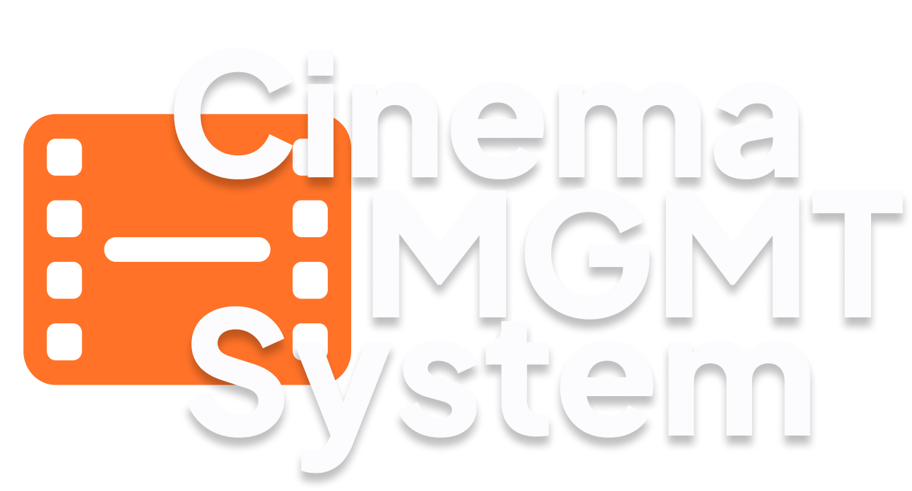

<p align="center">
  
</p>

# 

<p align="center">
  
  
  
  
</p>

<h2>Description</h1>
<p style="font-weight: 200;">This project is a cinema management system designed to manage a movie catalog. It was developed with a strong focus on the <strong>Backend</strong>, implementing an architecture that separates business logic from data persistence, enabling full CRUD operations.</p>

<h2>Tech Stack</h2>
<p style="font-weight: 200;">
• <strong>Language:</strong> Java<br>
• <strong>Dependency Manager:</strong> Maven<br>
• <strong>Persistence:</strong> MySQL with JDBC<br>
• <strong>Application Server:</strong> Apache Tomcat 9.0<br>
• <strong>Data Processing:</strong> Jackson (JSON)<br>
• <strong>Frontend:</strong> HTML, CSS, JS<br>
• <strong>Testing:</strong> Postman<br>
• <strong>Methodology:</strong> SCRUM (Team of 4 people)
</p>

<h2>Key Features</h2>
<p style="font-weight: 200;">
• <strong>REST API:</strong> Full implementation of endpoints for movie management.<br>
• <strong>Integration & Testing:</strong> End-to-end data flow testing and endpoint validation using Postman.<br>
• <strong>Asynchronous Logic:</strong> Dynamic response handling using JSON format.
</p>

<h2>Environment Setup</h2>

<p style="font-size: 18px; font-weight: 500;">Prerequisites</p>
<p style="font-weight: 200;">JDK 17, Apache Tomcat 9.0 (Configured on port <code>8090</code>) and MySQL.</p>

<h3>Installation</h3>
<p style="font-weight: 200;">
1. <strong>Database:</strong> Import the <code>movies_db.sql</code> file located in the <code>/resource</code> folder.<br>
2. <strong>Clone the repository:</strong>
</p>


[https://github.com/your-username/cinema-management-system.git](https://github.com/your-username/cinema-management-system.git)


<h2>Credentials</h2>
<p style="font-weight: 200;">Update your database user and password in <strong>DatabaseConnection.java</strong>.</p>

<h3>Api Endpoints</h3>
<p style="font-weight: 200;">
• <strong>GET /movies/{id}:</strong> Gets a movie by ID.<br>
• <strong>POST /movies:</strong> Create a new movie.<br>
• <strong>PUT /movies/{id}:</strong> Update an existing movie.<br>
• <strong>DELETE /movies/{id}:</strong> Delete a movie by ID.
</p>
<br>

> [!TIP]
> **For PUTs on postman:**
> <p style="font-weight: 200;">
> 1. Select <strong>Body</strong><br>
> 2. Select <strong>Rows</strong> (Raw)<br>
> 3. Paste the following <strong>JSON</strong> on rows:
> </p>

<br>

```json
{
  "id": 1,
  "title": "The Lord of the Rings",
  "director": "Peter Jackson",
  "genre": "Fantasy"
}